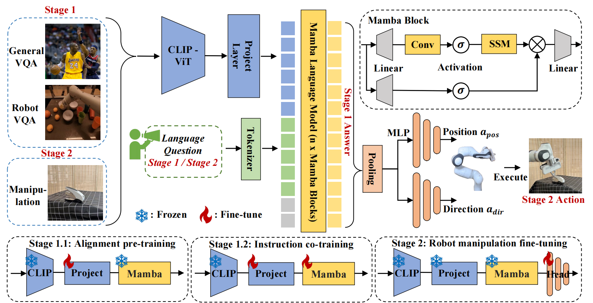

# roboMamba

The repo of paper `RoboMamba: Multimodal State Space Model for Efficient Robot Reasoning and Manipulation`

**Table 1: Comparison of general reasoning abilities with previous MLLMs on several benchmarks.**

|     Method      | LLM Size | Res. |  OKVQA   |  VQAV2   |   GQA    |  VizWiz  | OCR-VQA  |   POPE   |    MME     |   MMB    |  MM-Vet  |
| :-------------: | -------- | :--: | :------: | :------: | :------: | :------: | :------: | :------: | :--------: | :------: | :------: |
|     BLIP-2      | 7B       | 224  |   45.9   |    -     |   41.0   |   19.6   |   40.6   |   85.3   |   1293.8   |    -     |   22.4   |
|  InstructBLIP   | 7B       | 224  |    -     |    -     |   49.5   |   33.4   |   44.8   |    -     |     -      |    36    |   26.2   |
| LLaMA-AdapterV2 | 7B       | 336  |   49.6   |   70.7   |   45.1   |   39.8   |    -     |    -     |   1328.4   |    -     |    -     |
|   MiniGPT-v2    | 7B       | 448  |   57.8   |    -     |   60.1   |   53.6   |    -     |    -     |     -      |    -     |    -     |
|     Qwen-VL     | 7B       | 448  |   58.6   |   79.5   |   59.3   |   35.2   | **75.7** |    -     |     -      |   38.2   |    -     |
|    LLaVA1.5     | 7B       | 336  |    -     |   78.5   |   62.0   |   50.0   |    -     |   85.9   | **1510.7** |   64.3   |   30.5   |
|     SPHINX      | 7B       | 224  |   62.1   |   78.1   |   62.6   |   39.9   |   66.0   |   80.7   |   1476.1   |   66.9   | **36.0** |
|    LLaVA-Phi    | 2.7B     | 336  |    -     |   71.4   |    -     |   35.9   |    -     |   85.0   |   1335.1   |   59.8   |   28.9   |
|    MobileVLM    | 2.7B     | 336  |    -     |    -     |   59.0   |    -     |    -     |   84.9   |   1288.9   |   59.6   |    -     |
|    TinyLLaVA    | 2.7B     | 336  |    -     |   77.7   |   61.0   |    -     |    -     |   86.3   |   1437.3   | **68.3** |   31.7   |
| RoboMamba(Ours) | 2.7B     | 224  | **63.1** | **80.3** |   62.4   |   55.0   |   62.5   |   85.3   |   1314.8   |   64.2   |   28.6   |
| RoboMamba(Ours) | 2.7B     | 384  |   62.4   |   79.1   | **64.4** | **55.0** |   66.7   | **86.9** |   1354.2   |   65.7   |   29.7   |

**Table 2: Comparison of the success rates between RoboMamba and baselines across various training (seen) and test (unseen) categories.**

Code is coming soon !
