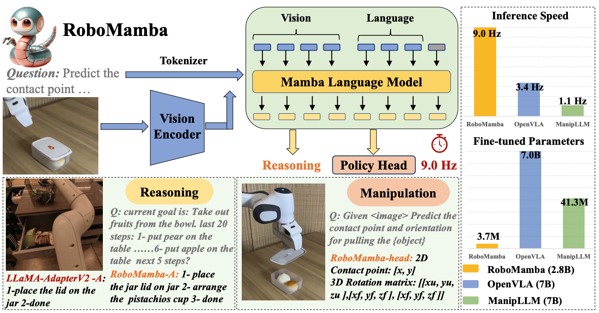
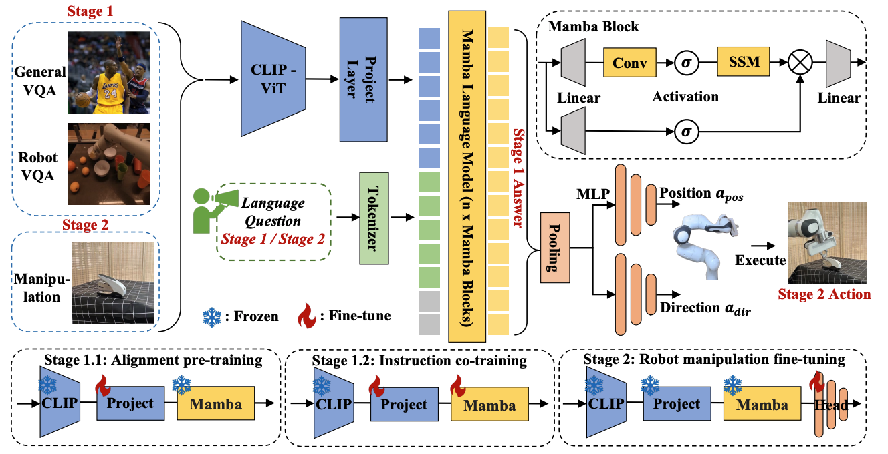
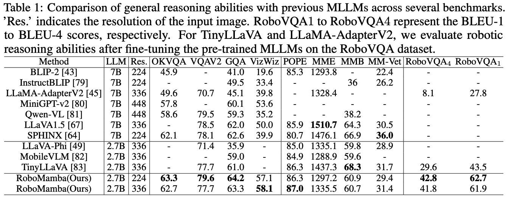
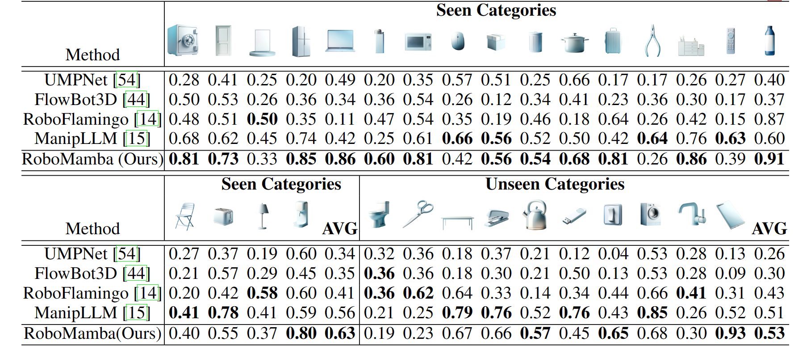

# roboMamba

The repo of paper `RoboMamba: Multimodal State Space Model for Efficient Robot Reasoning and Manipulation`




Our main contributions are :

+ We innovatively integrate a vision encoder with the efficient Mamba language model to construct our end-to-end RoboMamba, which possesses visual common sense and robot-related reasoning abilities.
+ To equip RoboMamba with action pose prediction abilities, we explore an efficient fine-tuning strategy using a simple policy head. We find that once RoboMamba achieves sufficient reasoning capabilities, it can acquire pose prediction skills with minimal cost.
+ In our extensive experiments, RoboMamba excels in reasoning on general and robotic evaluation benchmarks, and showcases impressive pose prediction results in both simulation and real-world experiments





**Table 2: Comparison of the success rates between RoboMamba and baselines across various training (seen) and test (unseen) categories.**



**installation**

pip install -r requirements.txt

**How to test**

test: `bash script/test.sh`


**Checkpoint**

The checkpoints are shown in the test branch.. Thank you very much for your interest in our work. If you need the training code, please send us an email and specify your research requirements.


## 📚 BibTeX 

```bibtex
@inproceedings{liurobomamba,
  title={RoboMamba: Efficient Vision-Language-Action Model for Robotic Reasoning and Manipulation},
  author={Liu, Jiaming and Liu, Mengzhen and Wang, Zhenyu and An, Pengju and Li, Xiaoqi and Zhou, Kaichen and Yang, Senqiao and Zhang, Renrui and Guo, Yandong and Zhang, Shanghang},
  booktitle={The Thirty-eighth Annual Conference on Neural Information Processing Systems}
}
```